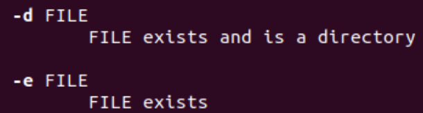

# Recycle-Bin
## 用法
参考[Bash脚本](https://ryanstutorials.net/bash-scripting-tutorial/bash-script.php)的介绍。
```bash
   #（以文件a为例）
   my_rm ./××/.../a #将文件a移到回收站
   my_fm ~/××/.../a #将回收站目录a下的原文件恢复到其原路径
   # 要把这两个脚本所在的路径添加到PATH环境变量后才能直接这样用，否则使用时还要指明脚本所在的路径
 ```

将my_autodel脚本添加到[cron](https://www.runoob.com/w3cnote/linux-crontab-tasks.html)相应的配置文件中。

## 记录一下我的思考
### 概览
&emsp;把文件移到回收站与直接永久删除文件（`rm`命令）的不同在于，当我们后悔删除文件这一行为时，还可以从回收站中找出该文件，恢复到原路径。所以，回收站首先需要占用系统中的一部分存储空间，用以暂存我们可能想恢复的文件。同时，既然是删除文件，这些被移动到回收站的文件不能越积越多，需要系统定期清理在回收站内超过一定时间阈值的文件，留出能继续使用的足够的空间。


&emsp;我为回收、恢复和系统自动永久删除分别各写了一个Bash脚本。

### 在开始所有工作前的一些想法

1.回收站应不影响整个系统和其他用户  

    规定各个用户的回收站路径为：（如用户user1）
    /home/user1/recycle_bin（~/recycle_bin）  

2.应能支持用户先后将**同名**文件移到回收站

3.若用户的主目录下还没有recycle_bin目录，那么在用户**第一次**执行回收的脚本时，应**自动**为该用户在其主目录下创建一个，而不需要用户先显示地用mkdir命令自己创建这个目录。

4.应让用户能方便地（即不需要自己去阅读和修改相关脚本）自定义系统自动永久删除回收站内文件的“时间阈值”。

### 细节

1.为实现文件恢复和系统自动永久删除两个功能，在将文件移动到回收站的同时，需记录文件的**原始路径**和**移动到回收站的时间**（即需要创建和维护相应的数据结构）。如何实现这个数据结构会影响后续很多相关代码的具体实现。
    
    一种可行（但并不一定是高效的）实现方案如下：

    
    对每一个被移动到回收站的文件，为其在~/recycle_bin目录下创建一个一一对应的目录，将文件移到此目录下（文件名不必修改），同时新建original_path文件和delete_time文件，分别用于记录原始路径和被删除时间。

2.文件名和路径名本质上是字符串，在脚本中处理文件名和路径名时需要用到一些字符串处理方法。

* 用户执行回收脚本时，可能会提供**各种形式的路径** （以文件a为例）：
      
        /××/××/.../a  
        ./××/.../a  
        ../××/.../a  
        ~/××/.../a  
        ××/.../a  
        也不是没有可能出现一些组合如~/../××/.../a，这些组合无法列举完。

  相对路径总是基于用户所在的当前目录。  
  由于执行回收脚本时，用户所在的目录和执行恢复脚本时用户所在的目录可能不同，回收时都应该记录相应的绝对路径，所以此处应该提供各种形式的路径转化为绝对路径的方法。

  ```bash

   AbsolutePath=$(realpath $FilePath) 
   # AbsolutePath：相应的绝对路径
   # realpath命令可以获得某个文件路径对应的绝对路径

  ```

  我自己开始是想这样解决这个问题的（利用`pwd`命令可以获得当前路径的绝对路径）：

 ```bash
    CurrentPath=$(pwd) #暂存当前路径
    cd $FilePath #跳转到用户提供的文件路径
    AbsolutePath=$(pwd) #此时用pwd命令可以获得对应的绝对路径
    cd $CurrentPath #跳转回当前路径
  ```

* 用户执行回收脚本时，提供的可能是被回收文件的绝对/相对路径。若要为被回收文件在~/recycle_bin目录下新建一个目录名和被回收文件名有关的目录，则需要从用户提供的路径结尾截取出被回收文件的文件名，此处应提供相应的方法。

```bash

FileName=${FilePath##*/} 
# FilePath：接收文件路径的变量
# FileName：接收文件名的变量
# FilePath##*/：从字符串变量FilePath的左侧开始，找到匹配符合*/的最长部分，将其剔除，返回剩下的内容

```

3.在大部分系统中，对时间点的表示有两大类方式：一种是符合人类表示习惯的方式，可以产生类似2022年10月07日10:43:26的效果，这种方法要存储的内容较多，也不便于计算机计算（部分系统并不提供基于这种时间格式的计算方法）；另一种则是更便于计算机存储和计算的方式，一般是记录1970年1月1日0时0分0秒到对应时间点的秒数，可以以补码存储。需要表示时间时，应根据具体需求选择合适的表示方法，业务场景更复杂时可能还要考虑时区、统一标准等等，虽然只是一个小细节，但有时会对后续的开发和维护产生很大影响。在命令行中输入`man date`可以查看在Bash中如何格式化时间。

* 用户执行恢复脚本时可能的场景是先看看自己想要恢复的文件是否还在回收站中  

再选择自己想要恢复的文件执行恢复脚本  

（应依据具体的业务需求设计得更精妙，这里就先简单化了~）

&emsp;可以在回收站下的为各个被回收文件所创建的目录的**目录名**处，提供**原文件名**和**被回收时间**的信息，以便用户判断其是否是自己想恢复的文件。  


&emsp;这里是要便于用户查看被回收时间的信息，所以应选择符合人类表示习惯的格式。

* 系统自动永久删除回收站内的文件时，会读取每一个文件的被回收时间和当前系统时间，计算这个文件是否已在回收站内超过事先设定的时间阈值，超过则永久删除。这个过程只需要计算机存储和计算，不需要人类用户参与，所以应选择便于计算机存储和计算的格式。

4.若用户的主目录下还没有recycle_bin目录，那么在用户**第一次**执行回收的脚本时，应**自动**为该用户在其主目录下创建一个，而不需要用户先显示地用mkdir命令自己创建这个目录。  
&emsp;在命令行中输入`man mkdir`，发现mkdir命令已为我们提供了非常方便的解决方法，自动帮我们创建还不存在的父目录。


 
```bash

NewDir=~/recycle_bin/"$FileName"_"${DeleteTime_Display}" 
mkdir -p $NewDir
# Newdir：为每个被回收文件新创建的目录的路径
# FileName：被回收文件的文件名
# DeleteTime_Display：符合人类表示习惯格式的回收时间

```

5.在执行回收、恢复脚本时，首先应检查用户输入的文件是否存在，若存在则按相应的逻辑继续执行，否则应提示错误信息。这里需要用到[Bash提供的分支逻辑的语句](https://ryanstutorials.net/bash-scripting-tutorial/bash-if-statements.php)。

&emsp;在Bash中，[ ]与命令test等价，在命令行中输入`man test`查看用法  



&emsp;以文件恢复为例：
```bash

FilePath=$@ #用户提供的路径（多种形式）
FileName=${FilePath##*/} #提取文件名
if [ -d ~/recycle_bin/$FileName ] #查看回收站内是否存在该文件
then
	...#文件恢复的处理逻辑
else
	echo $FilePath does not exist #提示错误信息
fi
```

6.[Bash命令行参数](https://www.w3cschool.cn/bashshell/bashshell-4wc337ip.html)

7.执行回收和恢复脚本时的进程属于前台进程，前台进程会使终端进程阻塞，关闭终端的同时也会杀死前台进程。相应的，后台进程不需要与终端交互，不受终端控制。显然，执行“系统自动删除回收站内超过一定时间阈值的文件”这一任务的进程应该是一个后台进程。（关于前后台进程、终端、会话、进程组等等[进程管理](https://ryanstutorials.net/linuxtutorial/processes.php)的内容我还需要从本质上更深入地学习）  
&emsp;[cron](https://www.runoob.com/w3cnote/linux-crontab-tasks.html)是Linux内置的服务，启动cron后（以后台进程的模式运行），它会定期检查相应配置文件中需要执行的任务，并按用户配置的频率在后台执行这些任务，可以用`crontab`命令操作这些配置文件。  
&emsp;借助cron的服务完成“系统自动删除回收站内超过一定时间阈值的文件”的功能。我们需要cron定期执行的任务即遍历当前回收站内所有的文件，读出其被回收时间，与当前系统时间比较，超过一定时间阈值则删除。这里除了用到分支逻辑，还需要用到Bash提供的[循环逻辑](https://ryanstutorials.net/bash-scripting-tutorial/bash-loops.php)语句。


***

* 对于最开始的想法2：应能支持用户先后将**同名**文件移到回收站  
细节的第3点，“在回收站下的为各个被回收文件所创建的目录的目录名处，提供原文件名和被回收时间的信息”从一定程度上也同时解决了这个问题。  
不过此处的时间只精确到了秒，对于用户手动操作文件回收的场景，一般可以保证创建的目录名至少有时间的秒数部分不重复。
另一个问题是这里出来的效果不太好，不管是视觉上，还是用户使用上，恢复文件时要提供一长串文件名这两方面。（不过反正是自己学习就先降低要求啦~）

* 经过对git和hadoop（最近也在学习这两个~）的一些命令的使用，我才意识到为什么实验室的师兄最开始建议我可以把回收和恢复写在同一个脚本里，具体执行哪个功能由用户给出参数来决定。如果用户不提供参数，则在终端打印出此脚本的用法（比如在终端直接执行git命令一样）。这样确实更便于使用，或许也更符合大家的习惯和规范。

* 创建两个文件original_path和delete_time只是为了后面写代码不用想那么多（偷懒）

* 最开始的想法3还没解决（偷懒）


